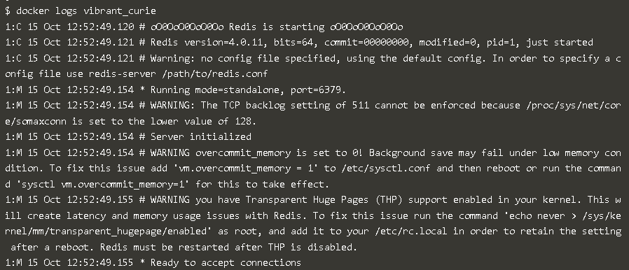
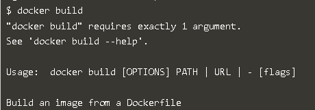
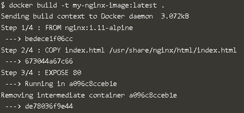
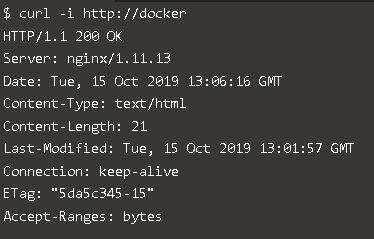
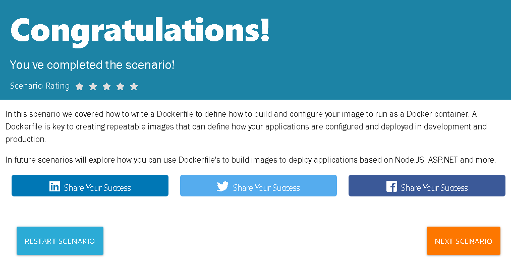

# Laporan Praktikum Pertemuan Minggu 06

1. Running A Container
- docker search redis berfungsi untuk mencari Image Redis yang ada di docker hub.

-docker run -d redis berfungsi untuk menjalankan image redis pada background.

2. Finding Running Containers
- docker ps berfungsi untuk melihat container yang sudah berjalan.

-docker inspect vibrant_curie berfungsi untuk melihat detail container.

- docker logs vibrant_curie berfungsi untuk melihat logs pada sebuah container yang berjalan.

3. Accessing redis
- docker run -d --name redisHostPort -p 6379:6379 redis:latest berfungsi untuk menjalankan container redisHostPort pada background.

4. Accessing redis
- docker run -d --name redisDynamic -p 6379 redis:latest berfungsi untuk menjalankan container redisDynamic pada background.

- docker port redisDynamic 6379 berfungsi untuk melihat list mapping port.

- docker ps berfungsi untuk melihat container yang sudah berjalan.

5. Persisting Data
- docker run -d --name redisMapped -v /opt/docker/data/redis:/data redis berfungsi untuk menjalankan image yang disertai dengan persistent volume.

6. Running A Container In The Foregroun
- docker run ubuntu ps berfungsi untuk menjalankan container ubuntu yang disertai dengan comment ps.

- docker run -it ubuntu bash berfungsi untuk masuk ke dalam container ubuntu.

1. Create Dockerfile

- membuat dockerfile, untuk membangun image dan menyalin konten ke editor.

2. Build Docker image

- docker build -t webserver-image:v1 berfungsi untuk membuat image statis HTML.

- docker image berfungsi untuk melihat list semua image yang ada di host yang digunakan.

3. Run
- docker run -d -p 80:80 webserver-image:v1 berfungsi untuk membuat image  dengan memberikan nama dan tag. Menggunakan port 80 karena web server dan menggunakan parameter -p untuk port.

- curl docker berfungsi untuk mengakses hasil port 80 melalui curl docker.

1. Base image
- Membuat image dasar dengan menyalin konten ke editor.

2. Running Commands
- mengcopy index.html ke editor ke directory /usr/share/nginx/html/index.html.

3. Exposing Ports

4. Default Commands

5. Building Containers
- docker build digunakan untuk membangun container.

 

 - docker build -t my-nginx-image:latest berfungsi untuk membuat sebuah image dengan nama my-nginx-image:latest dimana image ini dibuild berdasarkan konfigurasi dari file dockerfile.

 

- docker image berfungsi untuk melihat list semua image yang ada di host yang digunakan.

6. Launching New image
- docker run -d -p 80:80 my-nginx-image:latest berfungsi untuk menjalankan container my-nginx-image:latest pada background dengan menggunakan port 80.

- curl -i http://docker berfungsi untuk mengembalikan file indeks melalui NGINX dan image yang telah dibuat.

-docker  ps berfungsi untuk melihat containers yang sudah berjalan.

